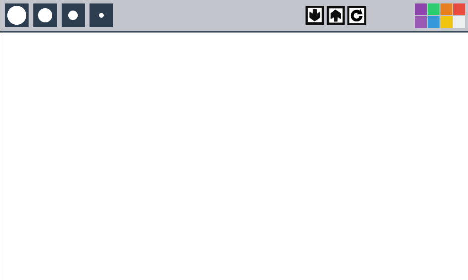

# TechSmart Image Editor
-------------------------
# Introduction : Working in The Editor

Upon opening the editor for the first time, you'll be met with this screen:

This is where you'll be drawing your images. The bar above is the Toolbar, where you can access things like the Color Pallette, Save and Load Buttons, Clear Screen button, Undo/Redo Buttons, etc.

# Notes and Recognition

This project is lisenced under the MIT License, the project is currently being worked on by Landen Barker, and Caleb Kinnard. For any questions/concerns about the product, please contact me at Landen.Barker@student.nisdtx.org. Thank You!

# Chapter 1 : The Color Pallette
