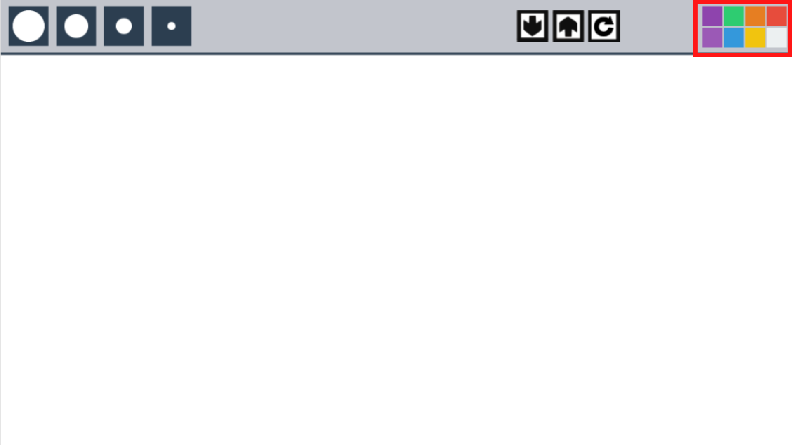
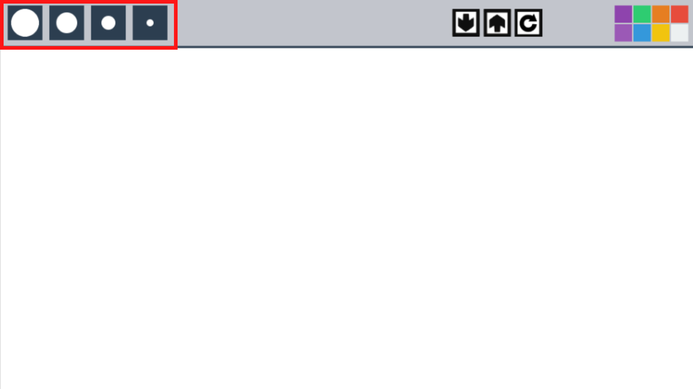
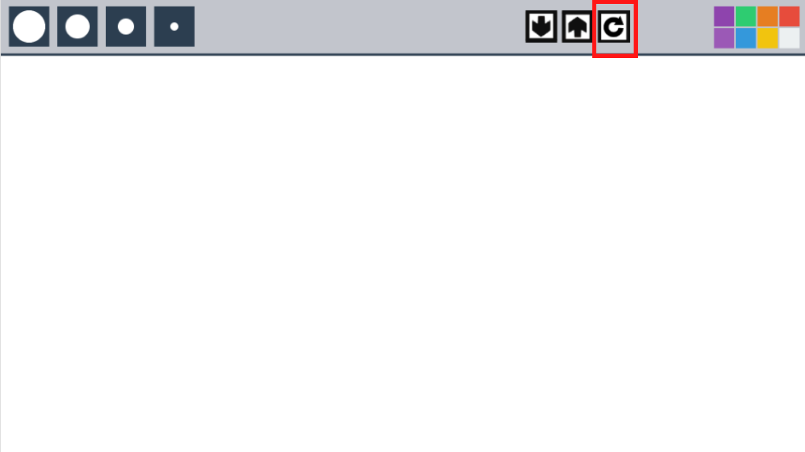
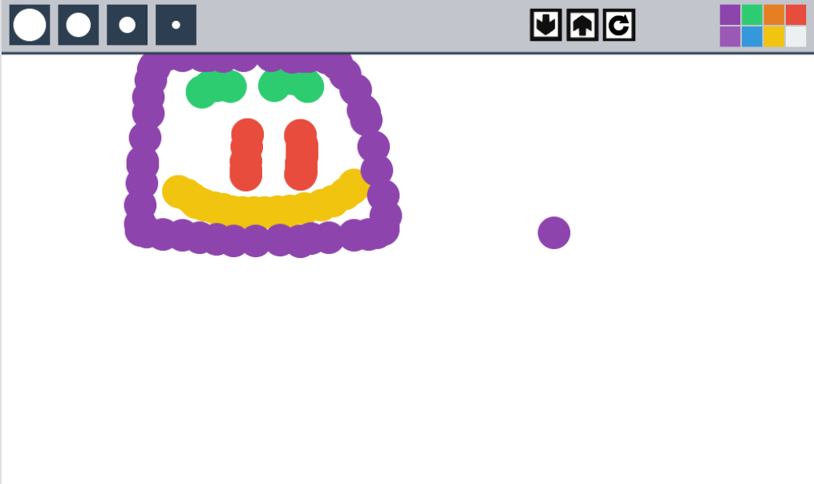
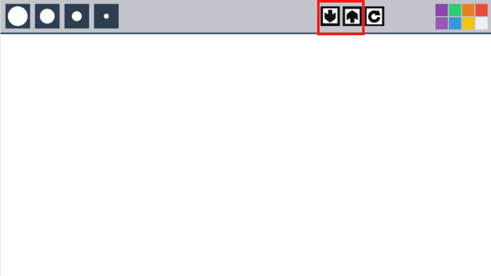

# TechSmart Image Editor ~ *version 0.0.1*
-------------------------
# Introduction : Working in The Editor

Upon opening the editor for the first time, you'll be met with this screen:

This is where you'll be drawing your images. The bar above is the Toolbar, where you can access things like the Color Pallette, Save and Load Buttons, Clear Screen button, Undo/Redo Buttons, etc.

# Notes and Recognition

This project is lisenced under the MIT License, the project is currently being worked on by Landen Barker, and Caleb Kinnard. For any questions/concerns about the product, please contact me at Landen.Barker@student.nisdtx.org. Thank You!

# Chapter 1 : The Color Pallette
When you first open the program, the color Red will be automatically selected for you. You can change the paint color by clicking on any of the Colored Squares. You can check to see whether your brush has changed colors by hovering the mouse cursor over the canvas area.

Custom Color Palletes and Switching Color Pallettes are coming in future updates!

# Chapter 2 : Brush Sizes
To change the brush size, click the corresponding buttons with the different circles. The Larger Circle is the Largest Size brush, and the Small Circle is the Smallest Size brush. Use the following Image for reference

# Chapter 3 : Clearing the Canvas
To clear the canvas, push the button that looks like a rotating arrow. Currently, in *version 0.0.1* the clear button **ONLY** works on pre-loaded Images. But we are currently working on a fix. When we push out *version 0.1.0*, you should be able to completely clear the canvas without closing the program.

# Chapter 4 : Saving and Loading your Image
Once you've finished your Image, you can save it. The Image will be encoded into 3 things:
1. Color Position
2. Color RGB
3. Brush Size

To save your image, navigate up to the Toolbar.

The arrow on the right is responsible for saving the project. Click the button, and exit the program.
